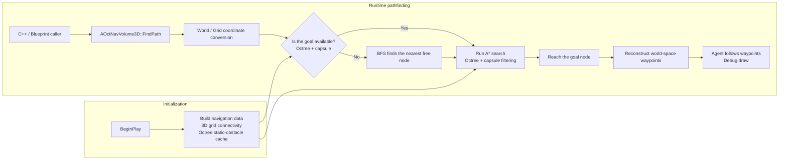

# SimpleNav3D | UE 5.6 volumetric pathfinding plugin and demo

**English** | [简体中文](README.zh-CN.md)

SimpleNav3D is a runtime plugin for **Unreal Engine 5.6**, written in **C++**. It handles 3D pathfinding for flying, swimming, and zero-gravity movement. The plugin divides a navigation volume into a regular 3D grid, runs A* to generate world-space waypoints, and rejects nodes that cannot fit the requested agent capsule. It exposes C++ and Blueprint APIs, and the repository includes a runnable demo map.

## Demo

<p align="center">
  <a href="https://youtu.be/LV2WPoSnrL8">
    
  </a>
</p>

Video: [SimpleNav3D Demo](https://youtu.be/LV2WPoSnrL8)

## Core implementation

- `AOctNavVolume3D` divides an actor volume into a configurable 3D grid. `DivisionsX/Y/Z` and `DivisionSize` control its coverage and resolution.
- `NavNode` objects are stored in a contiguous array with precomputed neighbour links. `MinSharedNeighborAxes` selects 6-, 18-, or 26-neighbour connectivity.
- A* uses a priority queue, `GScore`, a Euclidean heuristic, and `CameFrom` to calculate the route, then converts grid coordinates back into world-space waypoints.
- `FindPath` checks candidate nodes against the supplied Object Types and agent capsule dimensions. If the goal is occupied, BFS searches outward for the nearest free node.
- The octree handles coarse spatial occupancy queries and collapses a branch when all eight child nodes are blocked. Candidate nodes still pass through a capsule overlap check.
- `UProceduralMeshComponent` generates the debug grid in the Editor. The mesh uses double-sided triangles, so the navigation volume remains visible from inside and outside.
- `FindPath` is `BlueprintCallable`. The demo agent shows how to request a path, draw it, and move through its waypoints.

## Architecture and pathfinding flow

`AOctNavVolume3D` owns the navigation data, spatial queries, and public API. The grid and octree initialize in `BeginPlay`; callers provide a start point, destination, obstacle Object Types, and agent capsule dimensions.



<details>
<summary><strong>View the pathfinding steps</strong></summary>

1. `ConvertWorldLocationToGridCoordinates` maps the start and destination into the grid. Positions outside the volume are clamped to boundary cells.
2. `FindPath` checks the goal node first. If the octree marks it as blocked or a capsule overlap finds it occupied, the function calls `FindNearestFreeNode`.
3. `FindNearestFreeNode` runs BFS over neighbouring nodes and returns the closest node that can fit the current agent.
4. A* takes the node with the lowest `FScore` from the priority queue, skips blocked neighbours, and updates `GScore` and `CameFrom`.
5. After reaching the goal, the system walks back through `CameFrom` and outputs the cell centers as world-space waypoints.
6. The demo agent follows each waypoint and draws the path with debug lines and debug spheres.

</details>

## Features and source code

| Feature | Main implementation |
|---|---|
| **Runtime plugin and dependencies** | [SimpleNav3D.uplugin](Plugins/SimpleNav3D/SimpleNav3D.uplugin), [SimpleNav3D.Build.cs](Plugins/SimpleNav3D/Source/SimpleNav3D/SimpleNav3D.Build.cs) |
| **3D grid and neighbour graph** | [NavNode](Plugins/SimpleNav3D/Source/SimpleNav3D/Public/NavNode.h#L15), [Grid settings](Plugins/SimpleNav3D/Source/SimpleNav3D/Public/OctNavVolume3D.h#L333), [Grid initialization](Plugins/SimpleNav3D/Source/SimpleNav3D/Private/OctNavVolume3D.cpp#L70) |
| **World / grid coordinate conversion** | [World to grid](Plugins/SimpleNav3D/Source/SimpleNav3D/Private/OctNavVolume3D.cpp#L274), [Grid to world](Plugins/SimpleNav3D/Source/SimpleNav3D/Private/OctNavVolume3D.cpp#L289) |
| **A* and path reconstruction** | [NavNodeCompare](Plugins/SimpleNav3D/Source/SimpleNav3D/Public/NavNode.h#L35), [FindPath / A*](Plugins/SimpleNav3D/Source/SimpleNav3D/Private/OctNavVolume3D.cpp#L720), [Path reconstruction](Plugins/SimpleNav3D/Source/SimpleNav3D/Private/OctNavVolume3D.cpp#L852) |
| **BFS goal fallback** | [FindNearestFreeNode](Plugins/SimpleNav3D/Source/SimpleNav3D/Private/OctNavVolume3D.cpp#L357) |
| **Octree construction and queries** | [FOctreeNode](Plugins/SimpleNav3D/Source/SimpleNav3D/Public/OctNavVolume3D.h#L14), [BuildOctree](Plugins/SimpleNav3D/Source/SimpleNav3D/Private/OctNavVolume3D.cpp#L425), [QueryPointBlocked](Plugins/SimpleNav3D/Source/SimpleNav3D/Private/OctNavVolume3D.cpp#L519) |
| **Agent capsule collision checks** | [IsActorOverlapping](Plugins/SimpleNav3D/Source/SimpleNav3D/Private/OctNavVolume3D.cpp#L311) |
| **Procedural debug grid** | [Grid settings](Plugins/SimpleNav3D/Source/SimpleNav3D/Public/OctNavVolume3D.h#L333), [OnConstruction / mesh generation](Plugins/SimpleNav3D/Source/SimpleNav3D/Private/OctNavVolume3D.cpp#L552) |
| **Blueprint API** | [Coordinate conversion](Plugins/SimpleNav3D/Source/SimpleNav3D/Public/OctNavVolume3D.h#L133), [FindPath](Plugins/SimpleNav3D/Source/SimpleNav3D/Public/OctNavVolume3D.h#L163) |
| **Demo agent and path drawing** | [ANavDemoAgent](Source/TP_ThirdPerson/NavDemo/NavDemoAgent.h#L12), [RequestPath](Source/TP_ThirdPerson/NavDemo/NavDemoAgent.cpp#L79), [DrawCurrentPath](Source/TP_ThirdPerson/NavDemo/NavDemoAgent.cpp#L118), [Destination Marker](Source/TP_ThirdPerson/NavDemo/NavDemoDestinationMarker.cpp#L7) |
| **Default demo map** | [Nav3D_Demo.umap](Content/Nav3D_Demo.umap), [DefaultEngine.ini](Config/DefaultEngine.ini) |

## Public API

`FindPath` accepts a world-space start and destination. Callers can also provide obstacle Object Types, an agent to ignore, and the capsule dimensions used for collision checks.

```cpp
bool FindPath(
    const FVector& InStart,
    const FVector& InDestination,
    const TArray<TEnumAsByte<EObjectTypeQuery>>& InObjectTypes,
    UClass* InActorClassFilter,
    TArray<FVector>& OutPath,
    AActor* InActor = nullptr,
    float InDetectionRadius = 34.f,
    float InDetectionHalfHeight = 44.f
);
```

Example:

```cpp
TArray<FVector> Path;
if (NavVolume->FindPath(StartLocation, TargetLocation, ObjectTypes, nullptr, Path, Agent))
{
    // Follow the returned world-space waypoints.
}
```

## Running the demo

### Requirements

- Windows and **Unreal Engine 5.6**.
- Git LFS for syncing `.uasset`, `.umap`, and media files.
- A C++ toolchain supported by Unreal Engine, such as Visual Studio 2022.

### Steps

1. If this is your first time using Git LFS, run `git lfs install`.
2. After cloning the repository, run `git lfs pull` to download the demo map and plugin assets.
3. Open `PluginTest.uproject` with Unreal Engine 5.6.
4. Rebuild the project if the Editor reports missing Modules.
5. The project opens `/Game/Nav3D_Demo` by default. Press Play to have the demo agent request a path, draw its waypoints, and follow the route.

If the default level does not open automatically, load `Content/Nav3D_Demo.umap` manually.

## Integrating into another project

1. Copy `Plugins/SimpleNav3D` into the target project's `Plugins` directory.
2. Enable `SimpleNav3D` in the Editor's Plugins panel, then restart the Editor.
3. If a C++ module calls the plugin API directly, add `SimpleNav3D` to its `.Build.cs` dependencies and include `OctNavVolume3D.h`.
4. Place an `AOctNavVolume3D` in the level and configure `DivisionsX/Y/Z`, `DivisionSize`, neighbour connectivity, and the debug grid appearance.
5. Pass the Object Types and agent capsule dimensions to `FindPath`. The project's movement code can then process the returned waypoints.

## Use cases

- The plugin is intended for gameplay and AI prototypes that need volumetric navigation, including flying, swimming, and zero-gravity movement.
- The volume is aligned to the world axes. Actor rotation and non-unit scale do not affect the grid; use the Divisions and `DivisionSize` to set its coverage.
- The grid, neighbour graph, and octree are built in `BeginPlay`. The plugin does not rebuild them automatically when the volume configuration changes at runtime.
- Dynamic obstacles are checked with capsule overlap during each path request. The caller decides when to request a new path.
- The current output is a list of grid cell center waypoints without additional path smoothing.
- This is a gameplay and AI programming sample, not a replacement for Unreal NavMesh.

## Inspired By
- https://github.com/UEDimensionchan/NavAndPool
