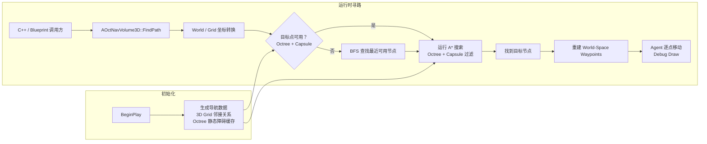

# SimpleNav3D | UE 5.6 体积寻路插件与演示

[English](README.md) | **简体中文**

SimpleNav3D 是一个用 **Unreal Engine 5.6 和 C++** 编写的 Runtime Plugin，解决飞行、游泳和零重力移动中的三维寻路问题。它将导航体积划分为规则 3D Grid，通过 A* 生成 World-Space Waypoints，并根据 Agent Capsule 尺寸排除无法通过的节点。插件提供 C++ 与 Blueprint API，仓库也包含可以直接运行的 Demo Map。

## 演示

<p align="center">
  <a href="https://youtu.be/LV2WPoSnrL8">
    
  </a>
</p>

视频链接：[SimpleNav3D Demo](https://youtu.be/LV2WPoSnrL8)

## 核心实现

- `AOctNavVolume3D` 将 Actor Volume 划分为可配置的 3D Grid，通过 `DivisionsX/Y/Z` 与 `DivisionSize` 控制覆盖范围和分辨率。
- `NavNode` 使用连续数组保存节点，并预先建立邻接关系。`MinSharedNeighborAxes` 可以在 6、18 和 26 邻接之间切换。
- A* 使用 Priority Queue、`GScore`、Euclidean Heuristic 和 `CameFrom` 计算路径，再把 Grid Coordinates 转回 World-Space Waypoints。
- `FindPath` 根据传入的 Object Types 和 Agent Capsule 尺寸检查候选节点。目标点被占用时，BFS 会从目标节点向外查找最近的可用节点。
- Octree 用于粗粒度的空间占用查询，并在八个子节点全部阻挡时压缩分支。最终候选节点仍会经过 Capsule Overlap 检查。
- `UProceduralMeshComponent` 在 Editor 中生成 Debug Grid。网格使用双面三角形，从体积内外都能看清导航范围。
- `FindPath` 暴露为 `BlueprintCallable`。Demo Agent 给出了路径请求、Debug Draw 和逐点移动的调用示例。

## 架构与寻路流程

`AOctNavVolume3D` 负责导航数据、空间查询和对外 API。Grid 与 Octree 在 `BeginPlay` 初始化；调用方只需要提交起点、目标点、障碍物 Object Types 和 Agent Capsule 尺寸。



<details>
<summary><strong>查看关键步骤</strong></summary>

1. `ConvertWorldLocationToGridCoordinates` 将起点和目标点映射到 Grid，超出 Volume 的坐标会被限制到边界 Cell。
2. `FindPath` 先检查目标节点。如果该位置被 Octree 标记或被 Capsule Overlap 检测为占用，则调用 `FindNearestFreeNode`。
3. `FindNearestFreeNode` 使用 BFS 遍历相邻节点，返回距离原目标最近且可以容纳当前 Agent 的节点。
4. A* 从 Priority Queue 取出最低 `FScore` 节点，跳过被阻挡的 Neighbor，并更新 `GScore` 与 `CameFrom`。
5. 到达目标后，系统沿 `CameFrom` 反向重建路径，并输出 Cell Center 对应的 World-Space Waypoints。
6. Demo Agent 按顺序移动到各 Waypoint，并使用 Debug Line 与 Debug Sphere 显示路径。

</details>

## 功能与源码（Feature → Source Code）

| Feature | 主要实现入口 |
|---|---|
| **Runtime Plugin 与依赖配置** | [SimpleNav3D.uplugin](Plugins/SimpleNav3D/SimpleNav3D.uplugin)、[SimpleNav3D.Build.cs](Plugins/SimpleNav3D/Source/SimpleNav3D/SimpleNav3D.Build.cs) |
| **3D Grid 与邻接图** | [NavNode.h](Plugins/SimpleNav3D/Source/SimpleNav3D/Public/NavNode.h)、[OctNavVolume3D.h](Plugins/SimpleNav3D/Source/SimpleNav3D/Public/OctNavVolume3D.h)、[Grid 初始化](Plugins/SimpleNav3D/Source/SimpleNav3D/Private/OctNavVolume3D.cpp) |
| **World / Grid 坐标转换** | [OctNavVolume3D.h](Plugins/SimpleNav3D/Source/SimpleNav3D/Public/OctNavVolume3D.h)、[OctNavVolume3D.cpp](Plugins/SimpleNav3D/Source/SimpleNav3D/Private/OctNavVolume3D.cpp) |
| **A* 与路径重建** | [NavNode Priority Queue](Plugins/SimpleNav3D/Source/SimpleNav3D/Public/NavNode.h)、[FindPath](Plugins/SimpleNav3D/Source/SimpleNav3D/Private/OctNavVolume3D.cpp) |
| **BFS 目标点回退** | [FindNearestFreeNode](Plugins/SimpleNav3D/Source/SimpleNav3D/Private/OctNavVolume3D.cpp) |
| **Octree 构建与查询** | [FOctreeNode](Plugins/SimpleNav3D/Source/SimpleNav3D/Public/OctNavVolume3D.h)、[BuildOctree / QueryPointBlocked](Plugins/SimpleNav3D/Source/SimpleNav3D/Private/OctNavVolume3D.cpp) |
| **Agent Capsule 阻挡检测** | [IsActorOverlapping](Plugins/SimpleNav3D/Source/SimpleNav3D/Private/OctNavVolume3D.cpp) |
| **Procedural Debug Grid** | [Grid 配置](Plugins/SimpleNav3D/Source/SimpleNav3D/Public/OctNavVolume3D.h)、[Mesh 生成](Plugins/SimpleNav3D/Source/SimpleNav3D/Private/OctNavVolume3D.cpp) |
| **Blueprint API** | [BlueprintCallable 接口](Plugins/SimpleNav3D/Source/SimpleNav3D/Public/OctNavVolume3D.h) |
| **Demo Agent 与路径显示** | [NavDemoAgent.h](Source/TP_ThirdPerson/NavDemo/NavDemoAgent.h)、[NavDemoAgent.cpp](Source/TP_ThirdPerson/NavDemo/NavDemoAgent.cpp)、[Destination Marker](Source/TP_ThirdPerson/NavDemo/NavDemoDestinationMarker.cpp) |
| **默认 Demo Map** | [Nav3D_Demo.umap](Content/Nav3D_Demo.umap)、[DefaultEngine.ini](Config/DefaultEngine.ini) |

## Public API

`FindPath` 接收 World-Space 起点与目标点。调用方还可以传入障碍物 Object Types、需要忽略的 Agent，以及用于碰撞检查的 Capsule 尺寸。

```cpp
bool FindPath(
    const FVector& InStart,
    const FVector& InDestination,
    const TArray<TEnumAsByte<EObjectTypeQuery>>& InObjectTypes,
    UClass* InActorClassFilter,
    TArray<FVector>& OutPath,
    AActor* InActor = nullptr,
    float InDetectionRadius = 34.f,
    float InDetectionHalfHeight = 44.f
);
```

调用示例：

```cpp
TArray<FVector> Path;
if (NavVolume->FindPath(StartLocation, TargetLocation, ObjectTypes, nullptr, Path, Agent))
{
    // Follow the returned world-space waypoints.
}
```

## 运行 Demo

### 运行环境

- Windows 与 **Unreal Engine 5.6**。
- Git LFS，用于同步 `.uasset`、`.umap` 和媒体文件。
- Unreal Engine 支持的 C++ Toolchain，例如 Visual Studio 2022。

### 步骤

1. 首次使用 Git LFS 时，执行 `git lfs install`。
2. 克隆仓库后执行 `git lfs pull`，确保 Demo Map 与插件 Assets 完整下载。
3. 使用 Unreal Engine 5.6 打开 `PluginTest.uproject`。
4. 如果 Editor 提示缺少 Modules，按提示重新编译项目。
5. 项目默认打开 `/Game/Nav3D_Demo`。点击 Play 后，Demo Agent 会请求路径、绘制 Waypoints 并沿路径移动。

如果默认关卡没有自动打开，可以手动加载 `Content/Nav3D_Demo.umap`。

## 接入其他项目

1. 将 `Plugins/SimpleNav3D` 复制到目标项目的 `Plugins` 目录。
2. 在 Editor 的 Plugins 面板启用 `SimpleNav3D`，然后重启 Editor。
3. C++ Module 如果需要直接调用插件 API，在 `.Build.cs` 中加入 `SimpleNav3D` 依赖，并包含 `OctNavVolume3D.h`。
4. 在关卡中放置 `AOctNavVolume3D`，配置 `DivisionsX/Y/Z`、`DivisionSize`、邻接规则和 Debug Grid 外观。
5. 调用 `FindPath` 时传入需要检测的 Object Types 和 Agent Capsule 尺寸。返回的 Waypoints 由项目自己的移动逻辑处理。

## 适用场景

- 适合需要体积寻路的 Gameplay 或 AI 原型，例如飞行、游泳和零重力移动。
- 当前 Volume 按 World Axis 对齐，Actor Rotation 与非单位 Scale 不参与 Grid 计算。覆盖范围应通过 Divisions 和 `DivisionSize` 调整。
- Grid、邻接图和 Octree 在 `BeginPlay` 构建。插件不会自动响应运行时的 Volume 配置变化。
- 动态障碍会在路径请求期间通过 Capsule Overlap 检查；何时重新请求路径由调用方决定。
- 当前输出为 Grid Cell Center Waypoints，没有额外的 Path Smoothing。
- 这是 Gameplay / AI 编程示例，不是 Unreal NavMesh 的替代方案。
